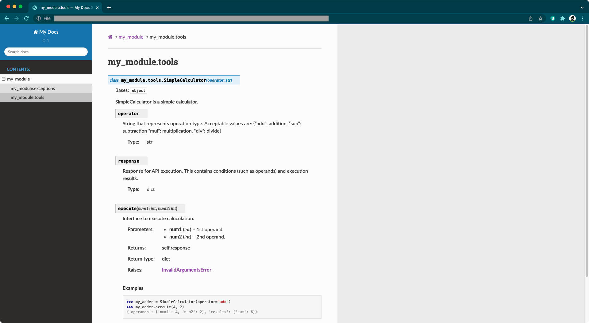

# はじめに

## a. 記事概要

* 自作 Python モジュールのドキュメンテーションを、ソースコードから自動生成していきます。
* ドキュメンテーション生成ツールである [Sphinx](https://www.sphinx-doc.org/en/master/) および、その拡張機能である [Napoleon](https://sphinxcontrib-napoleon.readthedocs.io/en/latest/) を利用します。

## b. 想定読者

以下のような課題感をお持ちの方を想定しています。

* チーム開発などで自作の Python モジュールを開発しているが、そのドキュメントが存在せず、運用とともに整備したい。
* またはドキュメントは存在するが、ソースコードと分離しており 統合管理できていない。

## c. 前提知識

本記事では docstring および Sphinx の基本的な知識を前提とし、それぞれ自体が何かといった説明は省いています。理解に不安のある方は、以下の記事などを参考に概要をご確認ください。

**docstring**
* 参考: [Pythonのdocstring（ドキュメンテーション文字列）の書き方 | note.nkmk.me](https://note.nkmk.me/python-docstring/)
* 参考: [[Python] docstringのスタイルと書き方 | by @flcn-x, Qiita](https://qiita.com/flcn-x/items/393c6f1f1e1e5abec906)

**Sphinx**
* 参考: [sphinx でドキュメント作成からWeb公開までをやってみた | by @kinpira | Qiita](https://qiita.com/kinpira/items/505bccacb2fba89c0ff0)
* 参考: [Sphinx ドキュメンテーション開発 : 標準設定 | by @roki18d, Qiita](https://qiita.com/roki18d/items/6ac55b44a8b35be25e52)

## d. リソース

本記事で使用するリソースは、GitHub に公開しています。

* [roki18d / sphinx_autogen_apidoc](https://github.com/roki18d/sphinx_autogen_apidoc)

## e. 動作確認環境

筆者が動作確認を行った環境は以下の通りです。

```
# OS
% sw_vers 
ProductName:    macOS
ProductVersion: 12.0.1
BuildVersion:   21A559

# Python
% python --version
Python 3.7.6
```

## 目次

# 1. 想定成果物について

## 何をするの？

自作 Python モジュールのソースコードから...


以下のような Sphinx ドキュメンテーションを自動生成していきます。



## リソースのディレクトリ構成

本記事では、初期状態として以下のような状態を想定しています。

```
% tree
.
├── LICENSE
├── README.md
├── my_module               # モジュール開発用ディレクトリ
│   ├── exceptions.py
│   └── tools.py
└── requirements.txt
```

本記事の『[3. 実施手順]()』を実施することで、`my_docs` が作られます。ビルドによって生成されるドキュメンテーションリソースは `my_docs/build` 以下に出力されます。

```
% tree
.
├── LICENSE
├── README.md
├── my_docs                 # ドキュメント開発用ディレクトリ
│   ├── Makefile                
│   ├── build               #   - ビルド後に生成されたリソースの出力先
│   └── source              #   - ドキュメント生成に必要なリソースの格納場所
│       ├── _static
│       ├── _templates
│       ├── conf.py
│       ├── index.rst
│       └── resources
├── my_module               # モジュール開発用ディレクトリ
│   ├── exceptions.py
│   └── tools.py
└── requirements.txt
```

# 2. 自作モジュールについて

ドキュメンテーション生成を実施する前に、ドキュメント化の対象となる自作モジュールがどのようなものか、本章で簡単に説明します。

## 2-1. 自作モジュールの説明

モジュール名は `my_module` としています。例として、四則演算を実行する `SimpleCalculator` クラスを実装した `tools.py` と、そこから利用される例外クラスを実装した `exceptions.py` を作成しています。（docstring 部分に主眼を置いているため、モジュールとして不出来はご容赦ください🙇‍♂️）

**tools.py**

以下は `tools.py` の一部抜粋です。（機能の概要説明のため docstring, およびプライベート関数の実装を省略しています）

```python
#!/usr/bin/env python
# coding: utf-8

from my_module.exceptions import InvalidArgumentsError

class SimpleCalculator(object): 
    
    def __init__(self, operator: str) -> None:
        valid_operators = ["add", "sub", "mul", "div"]
        if operator not in valid_operators:
            msg = f"Invalid operator '{operator}' was given, choose from {valid_operators}."
            raise InvalidArgumentsError(msg)
        else: 
            self.operator = operator
        self.response = dict()

    # 
    # (... 省略 ...)
    # 

    def execute(self, num1: int, num2: int):
        # 
        # (... 省略 ...)
        # 
        return self.response


if __name__ == "__main__":

    my_adder = SimpleCalculator(operator="add")
    print('Case01:', my_adder.execute(4, 2))
    print('Case02:', my_adder.execute(5, "a"))

    my_subtractor = SimpleCalculator(operator="sub")
    print('Case03:', my_subtractor.execute(3, 5))

    my_multiplier = SimpleCalculator(operator="mul")
    print('Case04:', my_multiplier.execute(2, 7))

    my_divider = SimpleCalculator(operator="div")
    print('Case05:', my_divider.execute(17, 5))
    print('Case06:', my_divider.execute(6, 0))

    print('Case07:')
    my_unknown = SimpleCalculator(operator="unknown")

    import sys; sys.exit(0)
```

スクリプトとして実行した場合の実行結果は以下のようになります。

```bash
% python my_module/tools.py

Case01: {'operands': {'num1': 4, 'num2': 2}, 'results': {'sum': 6}}
Case02: {'operands': {'num1': 5, 'num2': 'a'}, 'results': {'error_message': TypeError("unsupported operand type(s) for +: 'int' and 'str'")}}
Case03: {'operands': {'num1': 3, 'num2': 5}, 'results': {'difference': -2}}
Case04: {'operands': {'num1': 2, 'num2': 7}, 'results': {'product': 14}}
Case05: {'operands': {'num1': 17, 'num2': 5}, 'results': {'quotient': 3, 'remainder': 2}}
Case06: {'operands': {'num1': 6, 'num2': 0}, 'results': {'error_message': ZeroDivisionError('integer division or modulo by zero')}}
Case07:
Traceback (most recent call last):
  File "my_module/tools.py", line 116, in <module>
    my_unknown = SimpleCalculator(operator="unknown")
  File "my_module/tools.py", line 29, in __init__
    raise InvalidArgumentsError(msg)
my_module.exceptions.InvalidArgumentsError: Invalid operator 'unknown' was given, choose from ['add', 'sub', 'mul', 'div'].
```

|ケース|挙動|
|:--|:--|
|Case01|引数 (4, 2) の和 (sum) が `response` に格納されます。|
|Case02|引数に整数以外の値が含まれる場合、`TypeError` が発生し、エラーメッセージが `response` に格納されます。|
|Case03|引数 (3, 5) の差 (difference) が `response` に格納されます。|
|Case04|引数 (2, 7) の積 (product) が `response` に格納されます。|
|Case05|引数 (17, 5) の商 (quontient) および 余り (remainder) が `response` に格納されます。|
|Case06|割る数が 0 である場合、`ZeroDivisionError` が発生し、エラーメッセージが `response` に格納されます。|
|Case07|インスタンス初期化時に与える引数 (演算子文字列: operator) が事前定義されたものでない場合、カスタム例外 `InvalidArgumentsError` を発生させます。|

## 2-2. docstring スタイル

本モジュールでは、docstring のスタイルとして Google Style を採用します。後述の Napoleon は、Google Style のほか、NumPy Style をサポートしています。

* Google Style: [Example Google Style Python Docstrings | sphinxcontrib-napoleon.readthedocs.io](https://sphinxcontrib-napoleon.readthedocs.io/en/latest/example_google.html)
* NumPy Style: [Example NumPy Style Python Docstrings | sphinxcontrib-napoleon.readthedocs.io](https://sphinxcontrib-napoleon.readthedocs.io/en/latest/example_numpy.html#example-numpy)

Google Style の記法に従い、`tools.py` の `SimpleCclculator` クラスに対して以下のような docstring を記述しておきます。

```python
class SimpleCalculator(object): 
    """SimpleCalculator

    SimpleCalculator is a simple calculator.  

    Attributes: 
        operator (str): 
            String that represents operation type. 
            Acceptable values are: {"add": addition, "sub": subtraction
            "mul": multiplication, "div": divide}
        response (dict): 
            Response for API execution. 
            This contains conditions (such as operands) and execution results. 
    """

    # 
    # (... 省略 ...)
    # 

    def execute(self, num1: int, num2: int):
        """
        Interface to execute caluculation. 

        Args: 
            num1 (int): 1st operand. 
            num2 (int): 2nd operand. 

        Returns: 
            dict: self.response

        Raises: 
            InvalidArgumentsError: 

        Examples:
            >>> my_adder = SimpleCalculator(operator="add")
            >>> my_adder.execute(4, 2)
            {'operands': {'num1': 4, 'num2': 2}, 'results': {'sum': 6}}
        """
        # 
        # (... 省略 ...)
        # 
```

# 3. 実施手順

# 4. 落ち穂拾い

## 4-1. プライベート関数


# さいごに

# 参考

* [Sphinxの使い方．docstringを読み込んで仕様書を生成 | by @futakuchi0117, Qiita](https://qiita.com/futakuchi0117/items/4d3997c1ca1323259844)
* [doctest --- 対話的な実行例をテストする | docs.python.org](https://docs.python.org/ja/3/library/doctest.html)


---
EOF
