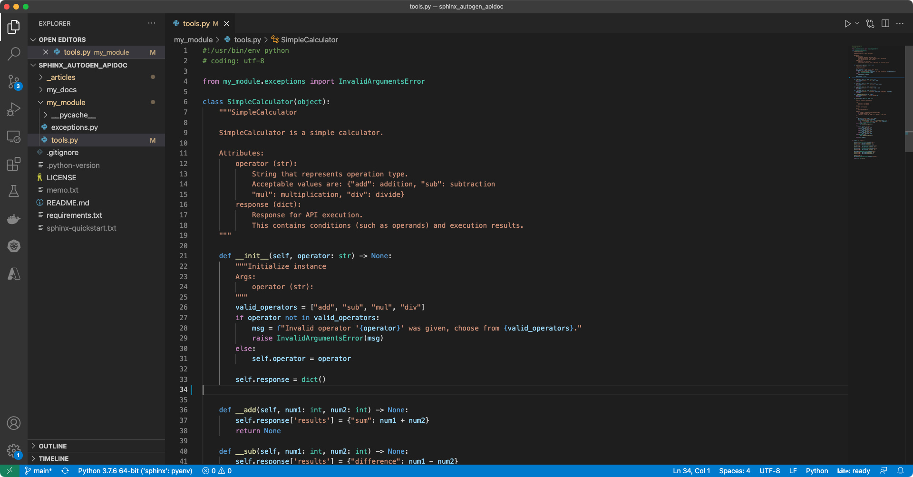
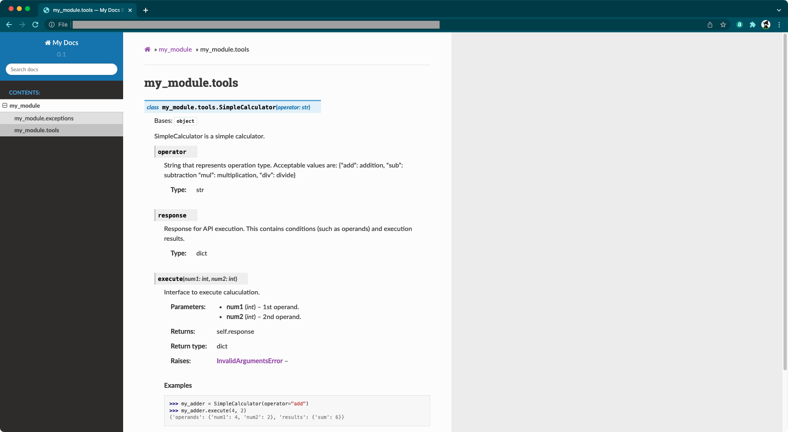
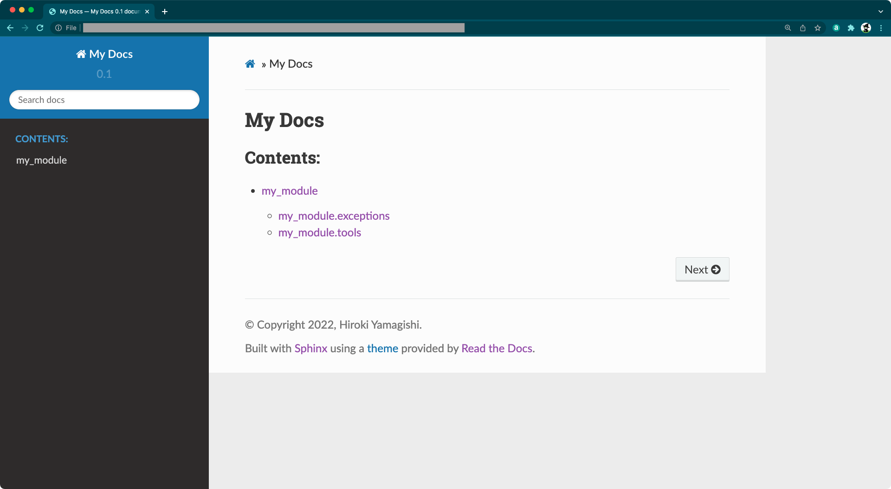

# はじめに

## a. 記事概要

* 自作 Python モジュールのドキュメンテーションを、ソースコードから自動生成していきます。
* ドキュメンテーション生成ツールである [Sphinx](https://www.sphinx-doc.org/en/master/) および、その拡張機能である [Napoleon](https://sphinxcontrib-napoleon.readthedocs.io/en/latest/) を利用します。

## b. 想定読者

以下のような課題感をお持ちの方を想定しています。

* チーム開発などで自作の Python モジュールを開発しているが、そのドキュメントが存在せず、運用とともに整備したい。
* またはドキュメントは存在するが、ソースコードと分離しており統合管理できていない。

## c. 前提知識

本記事では docstring および Sphinx の基本的な知識を前提としています。それぞれがどういったものかの説明は省いていますが、理解に不安のある方は以下の記事などを参考に概要をご確認ください。

**docstring**
* 参考: [Pythonのdocstring（ドキュメンテーション文字列）の書き方 | note.nkmk.me](https://note.nkmk.me/python-docstring/)
* 参考: [[Python] docstringのスタイルと書き方 | by @flcn-x, Qiita](https://qiita.com/flcn-x/items/393c6f1f1e1e5abec906)

**Sphinx**
* 参考: [sphinx でドキュメント作成からWeb公開までをやってみた | by @kinpira | Qiita](https://qiita.com/kinpira/items/505bccacb2fba89c0ff0)
* 参考: [Sphinx ドキュメンテーション開発 : 標準設定 | by @roki18d, Qiita](https://qiita.com/roki18d/items/6ac55b44a8b35be25e52)

## d. リソース

本記事で使用するリソースは、GitHub に公開しています。

* [roki18d / sphinx_autogen_apidoc](https://github.com/roki18d/sphinx_autogen_apidoc)

## e. 動作確認環境

筆者が動作確認を行った環境は以下の通りです。

```sh
# OS
% sw_vers 
ProductName:    macOS
ProductVersion: 12.0.1
BuildVersion:   21A559

# Python
% python --version
Python 3.7.6
```

## 目次

* [1. 想定成果物について](#1-想定成果物について)
* [2. 自作モジュールについて](#2-自作モジュールについて)
* [3. 実施手順](#3-実施手順)
* [4. 落穂拾い](#4-落穂拾い)

# 1. 想定成果物について

## 何をするの？

自作 Python モジュールのソースコードから、



以下のような Sphinx ドキュメンテーションを自動生成していきます。



## リソースのディレクトリ構成

本記事では、初期状態として以下のような状態を想定しています。

```sh
% tree
.
├── LICENSE
├── README.md
├── my_module               # モジュール開発用ディレクトリ
│   ├── exceptions.py
│   └── tools.py
└── requirements.txt
```

本記事の『[3. 実施手順](#3-実施手順)』を実施することで、`my_docs` が作られます。ビルドによって生成されるドキュメンテーションリソースは `my_docs/build` 以下に出力されます。

```sh
% tree
.
├── LICENSE
├── README.md
├── my_docs                 # ドキュメント開発用ディレクトリ
│   ├── Makefile                
│   ├── build               #   - ビルド後に生成されたリソースの出力先
│   └── source              #   - ドキュメント生成に必要なリソースの格納場所
│       ├── _static
│       ├── _templates
│       ├── conf.py
│       ├── index.rst
│       └── resources
├── my_module               # モジュール開発用ディレクトリ
│   ├── exceptions.py
│   └── tools.py
└── requirements.txt
```

# 2. 自作モジュールについて

ドキュメンテーション生成を実施する前に、ドキュメント化の対象となる自作モジュールがどのようなものか、本章で簡単に説明します。

## 2-1. 自作モジュールの説明

モジュール名は `my_module` としています。例として、四則演算を実行する `SimpleCalculator` クラスを実装した `tools.py` と、そこから利用される例外クラスを実装した `exceptions.py` を作成しています。（docstring 部分に主眼を置いているため、モジュールとしての不出来はご容赦ください🙇‍♂️）

**my_module/exceptions.py**

`Exception` クラスを継承しただけの `InvalidArgumentsError` を定義しています。用途としてはクラス名の通り、クラスやメソッドに対して無効な引数が与えられた場合に使用します。

```python
#!/usr/bin/env python
# coding: utf-8

class InvalidArgumentsError(Exception):
    pass
```

**my_module/tools.py**

以下は `tools.py` の一部抜粋です。（機能の概要説明のため docstring, およびプライベート関数の実装を省略しています）

```python
#!/usr/bin/env python
# coding: utf-8

from my_module.exceptions import InvalidArgumentsError

class SimpleCalculator(object): 
    
    def __init__(self, operator: str) -> None:
        valid_operators = ["add", "sub", "mul", "div"]
        if operator not in valid_operators:
            msg = f"Invalid operator '{operator}' was given, choose from {valid_operators}."
            raise InvalidArgumentsError(msg)
        else: 
            self.operator = operator
        self.response = dict()

    # 
    # (... 省略 ...)
    # 

    def execute(self, num1: int, num2: int):
        # 
        # (... 省略 ...)
        # 
        return self.response


if __name__ == "__main__":

    my_adder = SimpleCalculator(operator="add")
    print('Case01:', my_adder.execute(4, 2))
    print('Case02:', my_adder.execute(5, "a"))

    my_subtractor = SimpleCalculator(operator="sub")
    print('Case03:', my_subtractor.execute(3, 5))

    my_multiplier = SimpleCalculator(operator="mul")
    print('Case04:', my_multiplier.execute(2, 7))

    my_divider = SimpleCalculator(operator="div")
    print('Case05:', my_divider.execute(17, 5))
    print('Case06:', my_divider.execute(6, 0))

    print('Case07:')
    my_unknown = SimpleCalculator(operator="unknown")

    import sys; sys.exit(0)
```

スクリプトとして実行した場合の実行結果は以下のようになります。

```sh
% python my_module/tools.py

Case01: {'operands': {'num1': 4, 'num2': 2}, 'results': {'sum': 6}}
Case02: {'operands': {'num1': 5, 'num2': 'a'}, 'results': {'error_message': TypeError("unsupported operand type(s) for +: 'int' and 'str'")}}
Case03: {'operands': {'num1': 3, 'num2': 5}, 'results': {'difference': -2}}
Case04: {'operands': {'num1': 2, 'num2': 7}, 'results': {'product': 14}}
Case05: {'operands': {'num1': 17, 'num2': 5}, 'results': {'quotient': 3, 'remainder': 2}}
Case06: {'operands': {'num1': 6, 'num2': 0}, 'results': {'error_message': ZeroDivisionError('integer division or modulo by zero')}}
Case07:
Traceback (most recent call last):
  File "my_module/tools.py", line 116, in <module>
    my_unknown = SimpleCalculator(operator="unknown")
  File "my_module/tools.py", line 29, in __init__
    raise InvalidArgumentsError(msg)
my_module.exceptions.InvalidArgumentsError: Invalid operator 'unknown' was given, choose from ['add', 'sub', 'mul', 'div'].
```

|ケースID|挙動|
|:--|:--|
|Case01|引数 (4, 2) の和 (sum) が `response` に格納されます。|
|Case02|引数に整数以外の値が含まれる場合、`TypeError` が発生し、エラーメッセージが `response` に格納されます。|
|Case03|引数 (3, 5) の差 (difference) が `response` に格納されます。|
|Case04|引数 (2, 7) の積 (product) が `response` に格納されます。|
|Case05|引数 (17, 5) の商 (quontient) および 余り (remainder) が `response` に格納されます。|
|Case06|割る数が 0 である場合、`ZeroDivisionError` が発生し、エラーメッセージが `response` に格納されます。|
|Case07|インスタンス初期化時に与える引数 (演算子文字列: operator) が事前定義されたものでない場合、カスタム例外 `InvalidArgumentsError` を発生させます。|

## 2-2. docstring スタイル

本モジュールでは、docstring のスタイルとして Google Style を採用します。Napoleon は Google Style のほか、NumPy Style をサポートしています。

* [sphinx.ext.napoleon - Support for NumPy and Google style docstrings | sphinx-doc.org](https://www.sphinx-doc.org/en/master/usage/extensions/napoleon.html)
* Google Style: [Example Google Style Python Docstrings | sphinxcontrib-napoleon.readthedocs.io](https://sphinxcontrib-napoleon.readthedocs.io/en/latest/example_google.html)
* NumPy Style: [Example NumPy Style Python Docstrings | sphinxcontrib-napoleon.readthedocs.io](https://sphinxcontrib-napoleon.readthedocs.io/en/latest/example_numpy.html#example-numpy)

Google Style の記法に従い、`tools.py` の `SimpleCclculator` クラスに対して以下のような docstring を記述しておきます。

```python
class SimpleCalculator(object): 
    """SimpleCalculator

    SimpleCalculator is a simple calculator.  

    Attributes: 
        operator (str): 
            String that represents operation type. 
            Acceptable values are: {"add": addition, "sub": subtraction
            "mul": multiplication, "div": divide}
        response (dict): 
            Response for API execution. 
            This contains conditions (such as operands) and execution results. 
    """

    # 
    # (... 省略 ...)
    # 

    def execute(self, num1: int, num2: int):
        """
        Interface to execute caluculation. 

        Args: 
            num1 (int): 1st operand. 
            num2 (int): 2nd operand. 

        Returns: 
            dict: self.response

        Raises: 
            InvalidArgumentsError: 

        Examples:
            >>> my_adder = SimpleCalculator(operator="add")
            >>> my_adder.execute(4, 2)
            {'operands': {'num1': 4, 'num2': 2}, 'results': {'sum': 6}}
        """
        # 
        # (... 省略 ...)
        # 
```

# 3. 実施手順

## 3-1. 事前準備

適当なディレクトリ（以下、`$WORK_DIR`）配下で Git リポジトリをクローンし、移動します。

```sh
% cd $WORKDIR
% git clone https://github.com/roki18d/sphinx_autogen_apidoc.git
% cd sphinx_autogen_apidoc.git
```

本手順の実施によって作成されるリソースが既に存在するため、実施前に削除しておきます。（または `my_docs` を `my_docs2` など、別名に読み替えて実施してください）

```sh
% rm -rf my_docs
```

必要に応じて、pyenv や conda 等の Python 仮想環境にスイッチします。本記事では予め作成している `sphinx` という pyenv 仮想環境を使用します。

```sh
% pyenv local sphinx
(sphinx) % python --version
Python 3.7.6
```

実施に必要な Python ライブラリをインストールします。

```sh
% pip install -U pip
% pip install -r requirements.txt
```


## 3-2. プロジェクトの作成

`sphinx-quickstart` コマンドを実行し、プロジェクトを生成します。

```sh 
% sphinx-quickstart my_docs \
    --sep \
    --project "My Docs" \
    --author "{Your Name}" \
    -v 0.1 \
    --release 0.1 \
    --language='en' \
    --no-batchfile
```

オプション引数を与えず、各設定内容をインタラクティブに指定することもできます。
オプション引数で設定可能な項目については、以下をご確認ください。

* [sphinx-quickstart | sphinx-doc.org](https://www.sphinx-doc.org/en/master/man/sphinx-quickstart.html)

## 3-3. `conf.py` の編集

Sphinx ドキュメンテーションビルダーの設定ファイル `conf.py` を以下のように編集します。
必要に応じて設定内容を変更してください。

**my_docs/source/conf.py**

```python
# Configuration file for the Sphinx documentation builder.

# -- Path setup --------------------------------------------------------------
# import os
# import sys
# sys.path.insert(0, os.path.abspath('.'))
import sphinx_rtd_theme
import sphinx_fontawesome

# -- Project information -----------------------------------------------------
project = 'My Docs'
copyright = '2022, {Your Name}'
author = '{Your Name}'
version = '0.1'
release = '0.1'

# -- General configuration ---------------------------------------------------
extensions = [
    'sphinx.ext.autodoc', 
    'sphinx.ext.napoleon', 
    'sphinx_rtd_theme', 
    'sphinx_fontawesome', 
    'myst_parser', 
]
source_suffix = {
    '.rst': 'restructuredtext',
    '.md': 'markdown',
}

exclude_patterns = ['_build', 'Thumbs.db', '.DS_Store']
exclude_patterns = []

# -- Options for HTML output -------------------------------------------------
html_theme = "sphinx_rtd_theme"
html_theme_path = [sphinx_rtd_theme.get_html_theme_path()]
html_show_sourcelink = False
html_static_path = ['_static']
```

## 3-4. ドキュメントソースの生成

ドキュメントソース格納用のディレクトリを作成します。
（`docs/source` 直下に格納しても良いのですが、成果物全体の見通しが悪くなるため、専用のディレクトリを作成しています）

```sh
% mkdir my_docs/source/resources
```

`sphinx-apidoc` コマンドを実行し、ドキュメントソースを自動生成します。

```
% sphinx-apidoc --force -o my_docs/source/resources my_module
Creating file my_docs/source/resources/exceptions.rst.
Creating file my_docs/source/resources/tools.rst.
Creating file my_docs/source/resources/modules.rst
```

`sphinx-apidoc` コマンドの説明は以下の通りです。詳細は下記リンクをご確認ください。

> **sphinx-apidoc** is a tool for automatic generation of Sphinx sources that, using the autodoc extension, document a whole package in the style of other automatic API documentation tools.

* [sphinx-apidoc | sphinx-doc.org](https://www.sphinx-doc.org/en/master/man/sphinx-apidoc.html)

## 3-5. ドキュメントソースの編集

ドキュメントソースファイルを以下のように編集します。

**my_docs/resources/exceptions.rst**

```rest
my_module.exceptions
====================

.. automodule:: my_module.exceptions
   :members:
   :undoc-members:
   :show-inheritance:
```

**my_docs/resources/tools.rst**

```rest
my_module.tools
===============

.. automodule:: my_module.tools
   :members:
   :undoc-members:
   :show-inheritance:
```

**my_docs/resources/modules.rst**

```rest
my_module
=========

.. toctree::
   :maxdepth: 4

   exceptions
   tools
```

**my_docs/index.rst**

```rest
My Docs
============================================================

.. toctree::
   :maxdepth: 2
   :caption: Contents:

   resources/modules.rst
```

## 3-6. ドキュメントソースのビルド

`sphinx-build` コマンドを実行し、ドキュメントソースをビルドします。

```sh
% sphinx-build -b html my_docs/source my_docs/build 
Running Sphinx v4.3.1

# (... 省略 ...)

build succeeded.

The HTML pages are in my_docs/build.
```

ブラウザで `my_docs/build/index.html` を開くと、以下のようなページが表示されます。



# 4. 落穂拾い

## 4-1. プライベートメソッド

クラス内に実装したメソッドのうち、メソッド名先頭にアンダースコア2つがついているもの (例: `__hoge()`) はプライベートメソッドとして認識され、外部からの直接アクセスが出来なくなります。また、デフォルトで Sphinx ドキュメント生成の対象外となります。

本記事で使用した `SimpleCalculator` クラスでは、以下のようなプライベートメソッドを実装していました。

|メソッド名|概要|
|:--|:--|
|`__add()`|加算処理を実装した内部メソッド|
|`__sub()`|減算処理を実装した内部メソッド|
|`__mul()`|乗算処理を実装した内部メソッド|
|`__div()`|除算処理を実装した内部メソッド|
|`__handle_exceptions()`|例外ハンドリングを実装した内部メソッド|

ユーザに意識させる必要のない内部メソッドはプライベートメソッドとして実装しておき、ドキュメント生成の対象からも外しておくと良いでしょう。

## 4-2. 自動ビルド

ドキュメントソースを編集するたびにビルドを実行するのが面倒な場合、`sphinx-autobuild` の機能を利用して自動ビルドするこどができます。

```sh
% sphinx-autobuild my_docs/source my_docs/build

# (... 省略 ...)
build succeeded.

The HTML pages are in my_docs/build.
[I 220102 17:39:56 server:335] Serving on http://127.0.0.1:8000
```

この状態でブラウザから `http://127.0.0.1:8000` にアクセスすると、通常ビルド同様ドキュメンテーションが表示され、ドキュメントソースを編集・保存するたびにページが更新されます。

# さいごに

Python モジュールをチームで開発するようになると、規模が大きくなるにつれてモジュールの全容を把握するのが難しくなってきます。そのため、必要なタイミングでモジュールの使い方を参照できるようにしておくことが重要です。ソースコードからのドキュメント自動生成は、内容の正確性を担保しつつ、メンテナンスの運用を簡素化するのに非常に有効だと思います。

2022年一本目の投稿となりましたが、今年はコード自動生成技術の動向にもキャッチアップしていきたいと思います。

最後までご覧頂き、ありがとうございました。

# 参考

* [Sphinxの使い方．docstringを読み込んで仕様書を生成 | by @futakuchi0117, Qiita](https://qiita.com/futakuchi0117/items/4d3997c1ca1323259844)
* [doctest --- 対話的な実行例をテストする | docs.python.org](https://docs.python.org/ja/3/library/doctest.html)


---
EOF
